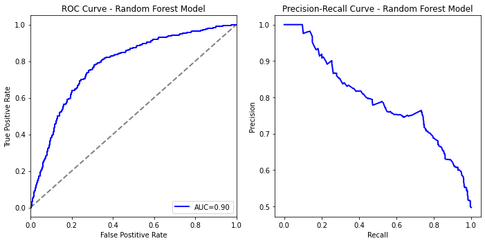

```python
#Our Libraries
import pandas as pd # used for handling the dataset
import numpy as np #used for handling numbers
import matplotlib.pyplot as plt


#Our tools

from sklearn.impute import SimpleImputer #handles missing data
from sklearn.preprocessing import LabelEncoder, OneHotEncoder, OrdinalEncoder #encoding categorical data
from sklearn.tree import DecisionTreeClassifier, plot_tree #Decision Tree
from sklearn.model_selection import train_test_split, cross_val_score, GridSearchCV, permutation_test_score #splitting training and testing data
from sklearn.preprocessing import StandardScaler, MinMaxScaler # feature scaling
from sklearn.neighbors import KNeighborsClassifier
from sklearn.linear_model import LogisticRegression, LinearRegression # Logistic Regression
from sklearn.metrics import mean_squared_error, accuracy_score, precision_score, recall_score, f1_score, classification_report, confusion_matrix, ConfusionMatrixDisplay, roc_curve, auc, precision_recall_curve #accuracy and precision
from scipy.stats import logistic
import statsmodels.api as sm
import seaborn as sns
from sklearn.ensemble import RandomForestClassifier
print("Complete!")
```

    Complete!
    


```python
#create dataframe of the csv 
df = pd.read_csv(r"\\apporto.com\dfs\SNHU\USERS\margotsmith_snhu\project1_eda_ready.csv")
print("Complete")
```

    Complete
    


```python
#checking the data
df.info()
df.isnull().any()
```

    <class 'pandas.core.frame.DataFrame'>
    RangeIndex: 5966 entries, 0 to 5965
    Data columns (total 29 columns):
     #   Column                    Non-Null Count  Dtype
    ---  ------                    --------------  -----
     0   Age                       5966 non-null   int64
     1   BusinessTravel            5966 non-null   int64
     2   DailyRate                 5966 non-null   int64
     3   Department                5966 non-null   int64
     4   DistanceFromHome          5966 non-null   int64
     5   Education                 5966 non-null   int64
     6   EducationField            5966 non-null   int64
     7   EnvironmentSatisfaction   5966 non-null   int64
     8   Gender                    5966 non-null   int64
     9   HourlyRate                5966 non-null   int64
     10  JobInvolvement            5966 non-null   int64
     11  JobLevel                  5966 non-null   int64
     12  JobRole                   5966 non-null   int64
     13  JobSatisfaction           5966 non-null   int64
     14  MaritalStatus             5966 non-null   int64
     15  NumCompaniesWorked        5966 non-null   int64
     16  OverTime                  5966 non-null   int64
     17  PercentSalaryHike         5966 non-null   int64
     18  PerformanceRating         5966 non-null   int64
     19  RelationshipSatisfaction  5966 non-null   int64
     20  StockOptionLevel          5966 non-null   int64
     21  TotalWorkingYears         5966 non-null   int64
     22  TrainingTimesLastYear     5966 non-null   int64
     23  WorkLifeBalance           5966 non-null   int64
     24  YearsAtCompany            5966 non-null   int64
     25  YearsInCurrentRole        5966 non-null   int64
     26  YearsSinceLastPromotion   5966 non-null   int64
     27  YearsWithCurrManager      5966 non-null   int64
     28  Attrition                 5966 non-null   int64
    dtypes: int64(29)
    memory usage: 1.3 MB
    


    Age                         False
    BusinessTravel              False
    DailyRate                   False
    Department                  False
    DistanceFromHome            False
    Education                   False
    EducationField              False
    EnvironmentSatisfaction     False
    Gender                      False
    HourlyRate                  False
    JobInvolvement              False
    JobLevel                    False
    JobRole                     False
    JobSatisfaction             False
    MaritalStatus               False
    NumCompaniesWorked          False
    OverTime                    False
    PercentSalaryHike           False
    PerformanceRating           False
    RelationshipSatisfaction    False
    StockOptionLevel            False
    TotalWorkingYears           False
    TrainingTimesLastYear       False
    WorkLifeBalance             False
    YearsAtCompany              False
    YearsInCurrentRole          False
    YearsSinceLastPromotion     False
    YearsWithCurrManager        False
    Attrition                   False
    dtype: bool


```python
#check attrition
df.Attrition.value_counts()
```


    0    4183
    1    1783
    Name: Attrition, dtype: int64


```python
df=df.drop('DailyRate', axis=1)
```


```python
print(df)
```

          Age  BusinessTravel  Department  DistanceFromHome  Education  \
    0      20               0           0                44          2   
    1      45               0           0                39          4   
    2      27               1           0                23          1   
    3      41               0           1                44          1   
    4      48               0           0                24          2   
    ...   ...             ...         ...               ...        ...   
    5961   36               1           1                23          2   
    5962   39               2           1                 6          1   
    5963   27               2           1                 4          3   
    5964   49               1           2                 2          3   
    5965   34               2           1                 8          3   
    
          EducationField  EnvironmentSatisfaction  Gender  HourlyRate  \
    0                  0                        1       2         126   
    1                  0                        3       2          75   
    2                  1                        4       0         123   
    3                  0                        3       0         140   
    4                  6                        4       0         116   
    ...              ...                      ...     ...         ...   
    5961               3                        3       3          41   
    5962               3                        4       3          42   
    5963               1                        2       3          87   
    5964               3                        4       3          63   
    5965               3                        2       3          82   
    
          JobInvolvement  ...  RelationshipSatisfaction  StockOptionLevel  \
    0                  4  ...                         4                 0   
    1                  4  ...                         4                 2   
    2                  4  ...                         1                 3   
    3                  4  ...                         1                 1   
    4                  2  ...                         2                 3   
    ...              ...  ...                       ...               ...   
    5961               4  ...                         3                 1   
    5962               2  ...                         1                 1   
    5963               4  ...                         2                 1   
    5964               2  ...                         4                 0   
    5965               4  ...                         1                 0   
    
          TotalWorkingYears  TrainingTimesLastYear  WorkLifeBalance  \
    0                    27                      5                2   
    1                    38                      3                4   
    2                    39                      0                3   
    3                    38                      6                3   
    4                    19                      5                2   
    ...                 ...                    ...              ...   
    5961                 17                      3                3   
    5962                  9                      5                3   
    5963                  6                      0                3   
    5964                 17                      3                2   
    5965                  6                      3                4   
    
          YearsAtCompany  YearsInCurrentRole  YearsSinceLastPromotion  \
    0                  8                   2                        0   
    1                 36                  15                        2   
    2                 32                  18                        0   
    3                 10                  18                       10   
    4                 10                   6                        7   
    ...              ...                 ...                      ...   
    5961               5                   2                        0   
    5962               7                   7                        1   
    5963               6                   2                        0   
    5964               9                   6                        0   
    5965               4                   3                        1   
    
          YearsWithCurrManager  Attrition  
    0                       14          0  
    1                       12          0  
    2                        8          1  
    3                       12          1  
    4                       15          1  
    ...                    ...        ...  
    5961                     3          0  
    5962                     7          0  
    5963                     3          0  
    5964                     8          0  
    5965                     2          0  
    
    [5966 rows x 28 columns]
    


```python
#checking columns for any data entry issues
for column in df.columns:
    unique_values = df[column].unique()
    print(f"Unique values in column '{column}': {unique_values}")
```

    Unique values in column 'Age': [20 45 27 41 48 47 51 55 44 33 52 25 34 37 18 35 32 54 40 57 36 23 59 39
     24 50 42 29 26 53 31 28 49 30 43 60 56 22 58 21 19 38 46]
    Unique values in column 'BusinessTravel': [0 1 2]
    Unique values in column 'Department': [0 1 2]
    Unique values in column 'DistanceFromHome': [44 39 23 24 36 16 45 43 26 50 37 30 34 38  7  8  5 48 47  9 14 41 13 12
     31  2 10  4 19 49 15 27  6 22  3 21 28 20 17 11 46  1 18 25 29 33 35 42
     32 40]
    Unique values in column 'Education': [ 2  4  1  3 14 16 12 18 20  5]
    Unique values in column 'EducationField': [0 1 6 4 5 3 2]
    Unique values in column 'EnvironmentSatisfaction': [1 3 4 2]
    Unique values in column 'Gender': [2 0 1 3]
    Unique values in column 'HourlyRate': [126  75 123 140 116 138  94  40  93 113  79  74 130  77 102 110  88  73
     132 142 105  31 150  98 131 148  71 141  53  69  72  58  97 109 111 117
      54  47 106 146 114  87 144  51 100  91  36  33 137  80 147 135 103  57
     145  90  67  89  39 108  61  52  56 124  62  65 129 107 136 122  59 139
     112  38  43  63  66  35  96  45 125  37 127  46 128  95  48 149  83  68
      78  86  50 121 104  84 133  49  30 143 101  70 118  32  99  81  82 120
      76  85  34  42 119  60 134 115  92  55  41  44  64]
    Unique values in column 'JobInvolvement': [4 2 1 3]
    Unique values in column 'JobLevel': [2 3 5 1 4]
    Unique values in column 'JobRole': [3 6 7 8 2 1 4 5 0]
    Unique values in column 'JobSatisfaction': [3 2 4 1]
    Unique values in column 'MaritalStatus': [1 2 0]
    Unique values in column 'NumCompaniesWorked': [6 3 1 8 4 7 5 0 2 9]
    Unique values in column 'OverTime': [0 1]
    Unique values in column 'PercentSalaryHike': [13 25 12 10 22 20 11 18 19 15 23 24 16 17 14 21]
    Unique values in column 'PerformanceRating': [2 1 3 4]
    Unique values in column 'RelationshipSatisfaction': [4 1 2 3]
    Unique values in column 'StockOptionLevel': [0 2 3 1]
    Unique values in column 'TotalWorkingYears': [27 38 39 19 12 22 34 40 14  0 35  8  4 23 11 24 16 31  9  7 33 17 29  3
     15 18 20 32 25  5  6 13 21 26  1 10 28  2 30 36 37]
    Unique values in column 'TrainingTimesLastYear': [5 3 0 6 1 4 2]
    Unique values in column 'WorkLifeBalance': [2 4 3 1]
    Unique values in column 'YearsAtCompany': [ 8 36 32 10 25 34 31 28 14 15 24  2 19 20  7 38 27 37  1 23 17 13  3 35
      9  6 29 40 18 26 22 21 39  5 11 30 16  0 12 33  4]
    Unique values in column 'YearsInCurrentRole': [ 2 15 18  6 20  3 17  4 13 10  8 19  5 14  7  9 12 16  1 11  0]
    Unique values in column 'YearsSinceLastPromotion': [ 0  2 10  7  4  8  5  1  9  6 15 13  3 12 11 14]
    Unique values in column 'YearsWithCurrManager': [14 12  8 15  9 13  2 17  7  0 11  4  5  3  1 10 16  6]
    Unique values in column 'Attrition': [0 1]
    


```python
#create corrletaion matrix
corr_with_attrition = df.drop(columns=['Attrition']).corrwith(df['Attrition']).sort_values(ascending=False)


#Plot
plt.figure(figsize=(10,6))
corr_with_attrition.plot(kind='bar', color=['skyblue' if c>= 0 else 'salmon' for c in corr_with_attrition])
plt.title('Correlation of Variables with Attrition')
plt.xlabel('Variables')
plt.ylabel('Correlation with Attrition')
plt.xticks(rotation=90)
plt.grid(axis='y', linestyle='--', alpha=0.7)
plt.tight_layout()
plt.show()
```


```python
#see significant correlations
significant_corr = corr_with_attrition[(corr_with_attrition >= 0.1) | (corr_with_attrition <= -0.1)]
print("Significant Correlations with Attrition:")
print(significant_corr)
```

    Significant Correlations with Attrition:
    Education                   0.273680
    DistanceFromHome            0.190387
    YearsSinceLastPromotion     0.159139
    MaritalStatus               0.152733
    YearsAtCompany              0.137535
    YearsInCurrentRole          0.127931
    HourlyRate                  0.121986
    NumCompaniesWorked          0.105473
    BusinessTravel             -0.113093
    RelationshipSatisfaction   -0.116470
    Gender                     -0.151212
    PerformanceRating          -0.390878
    dtype: float64
    


```python
#statistics
significant_features = significant_corr.index
summary_statistics = df[significant_features].describe()
print("Summary Statistics for Significant Features:")
print(summary_statistics)
```

    Summary Statistics for Significant Features:
             Education  DistanceFromHome  YearsSinceLastPromotion  MaritalStatus  \
    count  5966.000000       5966.000000              5966.000000    5966.000000   
    mean      9.438988         17.269695                 4.917868       1.298860   
    std       6.714727         14.116383                 4.810365       0.654872   
    min       1.000000          1.000000                 0.000000       0.000000   
    25%       3.000000          5.000000                 1.000000       1.000000   
    50%      12.000000         14.000000                 3.000000       1.000000   
    75%      16.000000         27.000000                 9.000000       2.000000   
    max      20.000000         50.000000                15.000000       2.000000   
    
           YearsAtCompany  YearsInCurrentRole   HourlyRate  NumCompaniesWorked  \
    count     5966.000000         5966.000000  5966.000000         5966.000000   
    mean        13.594536            7.178176    78.035367            3.412839   
    std         11.451638            5.805966    31.103325            2.621025   
    min          0.000000            0.000000    30.000000            0.000000   
    25%          4.000000            2.000000    53.000000            1.000000   
    50%         10.000000            7.000000    75.000000            3.000000   
    75%         22.000000           11.000000    97.000000            6.000000   
    max         40.000000           20.000000   150.000000            9.000000   
    
           BusinessTravel  RelationshipSatisfaction       Gender  \
    count     5966.000000               5966.000000  5966.000000   
    mean         1.305732                  2.629903     1.595709   
    std          0.803424                  1.050512     1.155536   
    min          0.000000                  1.000000     0.000000   
    25%          1.000000                  2.000000     0.000000   
    50%          2.000000                  3.000000     2.000000   
    75%          2.000000                  4.000000     3.000000   
    max          2.000000                  4.000000     3.000000   
    
           PerformanceRating  
    count        5966.000000  
    mean            2.879819  
    std             0.848531  
    min             1.000000  
    25%             3.000000  
    50%             3.000000  
    75%             3.000000  
    max             4.000000  
    


```python
overtime_summary = df['DistanceFromHome'].describe()

print("Summary Statistics for DistanceFromHome:")
print("Distance From Home:")
print(overtime_summary)
```

    Summary Statistics for DistanceFromHome:
    Distance From Home:
    count    5966.000000
    mean       17.269695
    std        14.116383
    min         1.000000
    25%         5.000000
    50%        14.000000
    75%        27.000000
    max        50.000000
    Name: DistanceFromHome, dtype: float64
    


```python
overtime_summary = df['HourlyRate'].describe()

print("Summary Statistics for Hourly Rate:")
print("Hourly Rate:")
print(overtime_summary)
```

    Summary Statistics for Hourly Rate:
    Hourly Rate:
    count    5966.000000
    mean       78.035367
    std        31.103325
    min        30.000000
    25%        53.000000
    50%        75.000000
    75%        97.000000
    max       150.000000
    Name: HourlyRate, dtype: float64
    


```python
overtime_summary = df['MaritalStatus'].describe()

print("Summary Statistics for Marital Status:")
print(overtime_summary)
```

    Summary Statistics for Marital Status:
    count    5966.000000
    mean        1.298860
    std         0.654872
    min         0.000000
    25%         1.000000
    50%         1.000000
    75%         2.000000
    max         2.000000
    Name: MaritalStatus, dtype: float64
    


```python
#our threshold will be for signifcance
threshold = 0.05
#filter for significant
significant_correlations = corr_with_attrition[abs(corr_with_attrition) >= threshold]
#sort
significant_correlations_sorted = significant_correlations.abs().sort_values(ascending=False)

#Print correlations
for variable in significant_correlations_sorted.index:
    correlation = significant_correlations[variable]
    print(f"{variable}: {abs(correlation)}")

print(significant_correlations_sorted)
```

    PerformanceRating: 0.3908783815348124
    Education: 0.2736804438050035
    DistanceFromHome: 0.1903873902856801
    YearsSinceLastPromotion: 0.15913907411057093
    MaritalStatus: 0.15273321923049485
    Gender: 0.15121239653738058
    YearsAtCompany: 0.13753488077032983
    YearsInCurrentRole: 0.12793135793535598
    HourlyRate: 0.12198576424163642
    RelationshipSatisfaction: 0.11646997630627655
    BusinessTravel: 0.11309302316764772
    NumCompaniesWorked: 0.10547252327217077
    PercentSalaryHike: 0.09382201698706112
    TotalWorkingYears: 0.08286203474542371
    WorkLifeBalance: 0.07766356736080186
    EducationField: 0.07461400636611831
    YearsWithCurrManager: 0.07331968806934282
    JobInvolvement: 0.06527537911299085
    JobSatisfaction: 0.06472952876797008
    EnvironmentSatisfaction: 0.06280075446069874
    StockOptionLevel: 0.05447022090391571
    PerformanceRating           0.390878
    Education                   0.273680
    DistanceFromHome            0.190387
    YearsSinceLastPromotion     0.159139
    MaritalStatus               0.152733
    Gender                      0.151212
    YearsAtCompany              0.137535
    YearsInCurrentRole          0.127931
    HourlyRate                  0.121986
    RelationshipSatisfaction    0.116470
    BusinessTravel              0.113093
    NumCompaniesWorked          0.105473
    PercentSalaryHike           0.093822
    TotalWorkingYears           0.082862
    WorkLifeBalance             0.077664
    EducationField              0.074614
    YearsWithCurrManager        0.073320
    JobInvolvement              0.065275
    JobSatisfaction             0.064730
    EnvironmentSatisfaction     0.062801
    StockOptionLevel            0.054470
    dtype: float64
    


```python
#Set independent and dependent variables
x = df.drop(columns=['Attrition'])
y = df['Attrition']
print("Complete")
```

    Complete
    


```python
# splitting the dataset into training set and test set
x_train, x_test, y_train, y_test = train_test_split(x, y, test_size=0.2, random_state=0)
print("Complete!")
```

    Complete!
    


```python
#create KNN
knn=KNeighborsClassifier(n_neighbors=5)
knn.fit(x_train, y_train)
#predict testing
y_pred_knn = knn.predict(x_test)
#eval
knn_accuracy = accuracy_score(y_test, y_pred_knn)
knn_precision = precision_score(y_test, y_pred_knn)
knn_recall = recall_score(y_test, y_pred_knn)
knn_f1 = f1_score(y_test, y_pred_knn)
#print it
print("K-NN Classifier Performance:")
print("Accuracy:", knn_accuracy)
print("Precision:", knn_precision)
print("Recall:", knn_recall)
print("F1-score:", knn_f1)
scores_knn = cross_val_score(knn, x_train, y_train, cv=5, scoring='accuracy')
mean_accuracy_knn = cross_val_score(knn, x_train, y_train, cv=5, scoring='accuracy')
mean_accuracy_knn=scores_knn.mean()
print("Cross-Validation Mean Accuracy (K-NN Classifier):", mean_accuracy_knn)

#confusion matrix
cm_knn=confusion_matrix(y_test, y_pred_knn)
print("Confusion Matrix:")
print(cm_knn)
plt.figure(figsize=(5,4))
sns.heatmap(cm_knn, annot=True, fmt='d')
plt.xlabel('Prediction')
plt.ylabel('Truth')
plt.title('k-NN Classifier Confusion Matrix')
plt.show()
```

    K-NN Classifier Performance:
    Accuracy: 0.6515912897822446
    Precision: 0.4530612244897959
    Recall: 0.2824427480916031
    F1-score: 0.34796238244514105
    Cross-Validation Mean Accuracy (K-NN Classifier): 0.6688978892950048
    Confusion Matrix:
    [[667 134]
     [282 111]]
    


```python
#calculate probabilities
y_prob_knn=knn.predict_proba(x_test)[:, 1]
#ROC Curve
fpr, tpr, _ = roc_curve(y_test, y_prob_knn)
roc_auc = auc(fpr, tpr)
#Visualize
plt.figure(figsize=(10,  5))
plt.subplot(1, 2, 1)
plt.plot([0, 1], [0, 1], color='gray', lw=2, linestyle='--')
plt.plot(fpr, tpr, color='blue', lw=2, label=f'ROC Curve (AUC = {roc_auc:.2f})')
plt.xlim([0.0, 1.0])
plt.ylabel('True Positive Rate')
plt.xlabel('False Postitive Rate')
plt.title('ROC Curve')
plt.legend(loc='lower right')
#
#precision-recall curve
precision, recall, _ = precision_recall_curve(y_test, y_prob_knn)
#visual
plt.subplot(1,2,2)
plt.plot(recall, precision, color='blue', lw=2)
plt.xlabel('Recall')
plt.ylabel('Precision')
plt.title('Precision-Recall Curve')
plt.show()
```


```python
#calculate count of attrition 
attrition_counts=df[df['Attrition']==1]['PerformanceRating'].value_counts()

# Attrition by Performance Rating
plt.figure(figsize=(10, 6))
sns.countplot(data=df[df['Attrition'] ==1], x='PerformanceRating', hue='Attrition')
plt.title('Attrition by Performance Rating')
plt.xlabel('Performance Rating')
plt.ylabel('Count')
plt.show()
```


```python
#calculate count of attrition 
attrition_counts=df[df['Attrition']==1]['PerformanceRating'].value_counts()
#calculate total number of emp
total_counts = df['PerformanceRating'].value_counts()
#relative frequency
relative_frequency=attrition_counts/total_counts
#convert the result to df for plotting
relative_frequency_df = relative_frequency.reset_index()
relative_frequency_df.columns= ['PerformanceRating','RelativeFrequency']

# Attrition by Performance Rating
plt.figure(figsize=(10, 6))
sns.barplot(x='PerformanceRating', y='RelativeFrequency', data=relative_frequency_df)
#data=df[df['Attrition'] ==1], x='PerformanceRating')
plt.title('Relative Frequency of Attrition by Performance Rating')
plt.xlabel('Performance Rating')
plt.ylabel('Relative Frequency')
plt.show()
```


```python
from matplotlib.patches import Patch
#calculate count of attrition 
attrition_counts_0 = df[df['Attrition'] == 0]['PerformanceRating'].value_counts()
attrition_counts_1 = df[df['Attrition'] == 1]['PerformanceRating'].value_counts()
#calculate total number of education
total_counts = df['PerformanceRating'].value_counts()
#relative frequency
relative_frequency_0 = attrition_counts_0 / total_counts
relative_frequency_1 = attrition_counts_1 / total_counts
#convert the result to df for plotting
relative_frequency_df_0 = relative_frequency_0.reset_index()
relative_frequency_df_0.columns = ['PerformanceRating', 'RelativeFrequency']
relative_frequency_df_0['Attrition'] = 'No'

relative_frequency_df_1 = relative_frequency_1.reset_index()
relative_frequency_df_1.columns = ['PerformanceRating', 'RelativeFrequency']
relative_frequency_df_1['Attrition'] = 'Yes'

#stacked bar chart
combined_df = pd.concat([relative_frequency_df_0, relative_frequency_df_1])
sns.barplot(data=relative_frequency_df_0, x='PerformanceRating', y='RelativeFrequency', color='blue')
sns.barplot(data=relative_frequency_df_1, x='PerformanceRating', y='RelativeFrequency', color='orange')
#Legend
legend_elements = [Patch(facecolor='blue', label='Attrition = No'), Patch(facecolor='orange', label='Attrition = Yes')]
plt.legend(handles=legend_elements)
#labels
plt.title('Relative Frequency of Attrition by Performance Rating')
plt.xlabel('Performance Rating')
plt.ylabel('Relative Frequency')
```


    Text(0, 0.5, 'Relative Frequency')


```python
plt.figure(figsize=(10, 6))
sns.countplot(data=df[df['Attrition']==1], x='Education')
plt.title('Attrition by Education Level')
plt.xlabel('Education Level')
plt.ylabel('Count')
plt.show()
```


```python
#calculate count of attrition 
attrition_counts=df[df['Attrition']==1]['Education'].value_counts()
#calculate total number of education
total_counts = df['Education'].value_counts()
#relative frequency
relative_frequency=attrition_counts/total_counts
#convert the result to df for plotting
relative_frequency_df = relative_frequency.reset_index()
relative_frequency_df.columns= ['Education','RelativeFrequency']

plt.figure(figsize=(10, 6))
sns.barplot(data=relative_frequency_df, x='Education', y='RelativeFrequency')
plt.title('Relative Frequency of Attrition by Education Level')
plt.xlabel('Education Level')
plt.ylabel('Relative Frequency')
plt.show()
```


```python
from matplotlib.patches import Patch
#calculate count of attrition 
attrition_counts_0 = df[df['Attrition'] == 0]['Education'].value_counts()
attrition_counts_1 = df[df['Attrition'] == 1]['Education'].value_counts()
#calculate total number of education
total_counts = df['Education'].value_counts()
#relative frequency
relative_frequency_0 = attrition_counts_0 / total_counts
relative_frequency_1 = attrition_counts_1 / total_counts
#convert the result to df for plotting
relative_frequency_df_0 = relative_frequency_0.reset_index()
relative_frequency_df_0.columns = ['Education', 'RelativeFrequency']
relative_frequency_df_0['Attrition'] = 'No'

relative_frequency_df_1 = relative_frequency_1.reset_index()
relative_frequency_df_1.columns = ['Education', 'RelativeFrequency']
relative_frequency_df_1['Attrition'] = 'Yes'

#stacked bar chart
combined_df = pd.concat([relative_frequency_df_0, relative_frequency_df_1])
sns.barplot(data=relative_frequency_df_0, x='Education', y='RelativeFrequency', color='blue')
sns.barplot(data=relative_frequency_df_1, x='Education', y='RelativeFrequency', color='orange')
#Legend
legend_elements = [Patch(facecolor='blue', label='Attrition = No'), Patch(facecolor='orange', label='Attrition = Yes')]
plt.legend(handles=legend_elements)
#labels
plt.title('Relative Frequency of Attrition by Education Level')
plt.xlabel('Education Level')
plt.ylabel('Relative Frequency')
```


    Text(0, 0.5, 'Relative Frequency')


```python
plt.figure(figsize=(10, 6))
sns.boxplot(data=df, x='Attrition', y='DistanceFromHome')
#Adjust labels
plt.xticks([0, 1], ['No', 'Yes'])
plt.title('Distance From Home Distribution by Attrition')
plt.xlabel('Attrition')
plt.ylabel('Distance From Home')
plt.show()
```


```python
# feature scaling
scaler = StandardScaler()
x_train = scaler.fit_transform(x_train)
x_test = scaler.transform(x_test)
print("Complete!")
```

    Complete!
    


```python
print("Training set after scaling:")
print(x_train[:5])
print("Testing set after scaling:")
print(x_test[:5])
```

    Training set after scaling:
    [[-0.53972895  0.86690994 -0.19379368 -0.85979797 -0.80593467  0.64547015
      -0.55159829 -0.51635949 -1.38639534  1.45406136 -1.12609812  0.63650468
       1.2377184  -0.45770774 -0.15345871 -0.39462359  0.15152183  0.13758404
       1.3064416   0.84958237 -0.87202715  0.03304827  0.40218629 -0.91493681
      -0.89190695 -1.01216578 -0.87337026]
     [ 1.64135418  0.86690994  1.23775962  0.49222274  1.27760698  1.17298917
       0.35139555  0.3482256  -1.45076152  1.45406136  1.80476648 -0.5579115
       1.2377184  -0.45770774 -0.15345871 -0.39462359 -1.24121433 -1.04752613
      -0.59630197  1.84766387 -0.32629304  1.21436933 -0.65407842  1.63889193
      -0.89190695  0.66471834 -1.0739151 ]
     [ 1.27784033 -1.61696531  1.23775962 -0.07704914  1.27760698  1.17298917
      -0.55159829  0.3482256   1.4457169   1.45406136 -0.39338197  1.03464341
       1.2377184  -0.45770774  0.61015438 -0.39462359 -0.08060086  1.32269421
       0.35506981 -0.14849913  2.22046616 -0.55761226 -0.65407842  1.46276581
       0.82637322  0.0358868   1.73371267]
     [-0.08533663 -0.37502769 -1.62534698  1.20381259  1.27760698  1.70050819
      -1.45459212 -1.38094458  0.15839315  0.40129534 -1.12609812  1.43278213
       0.33872415 -0.45770774  1.75557401 -0.39462359  1.08001261  0.13758404
      -0.59630197 -1.14658064  2.03855478 -0.55761226 -1.71034314 -0.47462151
       1.51368528  1.71277091 -0.47228058]
     [ 0.73256954 -0.37502769 -1.62534698  0.2075868   0.68230936  1.17298917
       0.35139555  0.3482256   0.38367481  1.45406136  1.07205033 -0.15977277
      -1.45926434 -0.45770774  0.99196092 -0.39462359  1.3121353   1.32269421
      -0.59630197  1.84766387 -0.78107147 -0.55761226 -1.71034314 -0.03430621
       1.6855133   0.0358868  -1.0739151 ]]
    Testing set after scaling:
    [[ 1.55047572 -0.37502769 -1.62534698  0.06526883  0.97995817  0.11795113
       1.25438938 -1.38094458 -1.28984605  0.40129534  0.33933418 -1.75232767
       0.33872415  1.0696918  -0.53526525 -0.39462359 -0.31272355  1.32269421
       0.35506981  0.84958237  1.76568773  1.80502986 -1.71034314  1.63889193
       1.51368528  0.66471834 -1.27445994]
     [ 0.45993415 -1.61696531  1.23775962 -0.71748     0.38466056  1.17298917
       0.35139555 -1.38094458  2.28247733  0.40129534 -1.12609812 -1.75232767
      -1.45926434  1.0696918   0.99196092 -0.39462359  1.77638069  0.13758404
       1.3064416  -0.14849913 -0.69011578 -1.73893331 -1.71034314  0.05375685
       1.34185727  0.24549731 -1.0739151 ]
     [ 0.0964203   0.86690994  1.23775962 -0.14820812 -0.80593467 -0.40956789
      -0.55159829  1.21281069 -0.03470541  0.40129534  1.07205033  1.03464341
      -1.45926434  1.0696918  -1.29887834 -0.39462359 -1.00909163  0.13758404
      -1.54767376 -1.14658064  0.49230813  0.03304827  0.40218629  0.58213521
       0.13906115  1.29354988  0.73098847]
     [-0.81236434  0.86690994 -1.62534698  0.13642782  0.68230936  1.70050819
      -0.55159829 -1.38094458  2.21811114 -0.65147067  1.07205033 -0.15977277
       0.33872415 -0.45770774 -1.29887834 -0.39462359  0.15152183 -1.04752613
      -0.59630197  0.84958237 -0.41724872  0.6237088   1.45845101 -0.38655845
       0.48271718  1.29354988  0.93153331]
     [-0.81236434  0.86690994  1.23775962 -0.50400304 -0.95475907 -0.40956789
       1.25438938  1.21281069  0.15839315  0.40129534 -1.12609812  1.43278213
      -0.56027009 -1.98510728 -0.91707179 -0.39462359 -0.54484625  0.13758404
       1.3064416   0.84958237 -1.23584989 -0.55761226  0.40218629 -1.00299987
      -0.89190695 -0.59294475 -0.87337026]]
    


```python
df.info()
```

    <class 'pandas.core.frame.DataFrame'>
    RangeIndex: 5966 entries, 0 to 5965
    Data columns (total 28 columns):
     #   Column                    Non-Null Count  Dtype
    ---  ------                    --------------  -----
     0   Age                       5966 non-null   int64
     1   BusinessTravel            5966 non-null   int64
     2   Department                5966 non-null   int64
     3   DistanceFromHome          5966 non-null   int64
     4   Education                 5966 non-null   int64
     5   EducationField            5966 non-null   int64
     6   EnvironmentSatisfaction   5966 non-null   int64
     7   Gender                    5966 non-null   int64
     8   HourlyRate                5966 non-null   int64
     9   JobInvolvement            5966 non-null   int64
     10  JobLevel                  5966 non-null   int64
     11  JobRole                   5966 non-null   int64
     12  JobSatisfaction           5966 non-null   int64
     13  MaritalStatus             5966 non-null   int64
     14  NumCompaniesWorked        5966 non-null   int64
     15  OverTime                  5966 non-null   int64
     16  PercentSalaryHike         5966 non-null   int64
     17  PerformanceRating         5966 non-null   int64
     18  RelationshipSatisfaction  5966 non-null   int64
     19  StockOptionLevel          5966 non-null   int64
     20  TotalWorkingYears         5966 non-null   int64
     21  TrainingTimesLastYear     5966 non-null   int64
     22  WorkLifeBalance           5966 non-null   int64
     23  YearsAtCompany            5966 non-null   int64
     24  YearsInCurrentRole        5966 non-null   int64
     25  YearsSinceLastPromotion   5966 non-null   int64
     26  YearsWithCurrManager      5966 non-null   int64
     27  Attrition                 5966 non-null   int64
    dtypes: int64(28)
    memory usage: 1.3 MB
    


```python
#random forest classifier
rf_clf = RandomForestClassifier(random_state=123)
rf_clf.fit(x_train, y_train)
#set y predict accordingly to random classifier
y_pred_random = rf_clf.predict(x_test)

#metrics for eval
random_accuracy = accuracy_score(y_test, y_pred_random)
random_precision = precision_score(y_test, y_pred_random)
random_recall = recall_score(y_test, y_pred_random)
random_f1 = f1_score(y_test, y_pred_random)
print("Random Classifier Accuracy:", random_accuracy)
print("Random Classifier Precision:", random_precision)
print("Random Classifier Recall:", random_recall)
print("Random Classifier F1-score:", random_f1)

cm = confusion_matrix(y_test, y_pred_random)
cm

plt.figure(figsize = (5,4))
sns.heatmap(cm, annot=True, fmt='d')
plt.xlabel('Prediction')
plt.ylabel('Truth')
plt.show()
```

    Random Classifier Accuracy: 0.8115577889447236
    Random Classifier Precision: 0.7372881355932204
    Random Classifier Recall: 0.6641221374045801
    Random Classifier F1-score: 0.6987951807228916
    


```python
# Create a series containing feature importances from the model and feature names from the training data
feature_importances = pd.DataFrame(rf_clf.feature_importances_,index = x.columns,columns=['importance']).sort_values('importance',ascending=False)
feature_importances.plot.barh(figsize=(10, 8))
```


    <matplotlib.axes._subplots.AxesSubplot at 0x1d6d63675b0>


```python
#Creating hyperparameters via GridSearchCV
param_grid = {
    'n_estimators': [50, 100, 200],
    'max_depth': [None, 10, 20, 30],
    'min_samples_split': [2, 5, 10],
    'min_samples_leaf': [1, 2, 4],
    'bootstrap': [True, False]
}
#Using GridSearchCV for best parameters
rf = RandomForestClassifier(random_state=123)
grid_search = GridSearchCV(estimator=rf, param_grid=param_grid, cv=3, n_jobs=-1, verbose=2, scoring ='f1')
grid_search.fit(x_train, y_train)
print("Best Parameters:", grid_search.best_params_)
```

    Fitting 3 folds for each of 216 candidates, totalling 648 fits
    

    [Parallel(n_jobs=-1)]: Using backend LokyBackend with 8 concurrent workers.
    [Parallel(n_jobs=-1)]: Done  25 tasks      | elapsed:    6.3s
    [Parallel(n_jobs=-1)]: Done 146 tasks      | elapsed:   22.5s
    [Parallel(n_jobs=-1)]: Done 349 tasks      | elapsed:   52.0s
    [Parallel(n_jobs=-1)]: Done 632 tasks      | elapsed:  1.7min
    [Parallel(n_jobs=-1)]: Done 648 out of 648 | elapsed:  1.7min finished
    

    Best Parameters: {'bootstrap': True, 'max_depth': 20, 'min_samples_leaf': 1, 'min_samples_split': 2, 'n_estimators': 200}
    


```python
best_rf = grid_search.best_estimator_
best_rf.fit(x_train, y_train)
#predict
y_pred_best_rf = best_rf.predict(x_test)
#evaluate
best_accuracy = accuracy_score(y_test, y_pred_best_rf)
best_precision = precision_score(y_test, y_pred_best_rf)
best_recall = recall_score(y_test, y_pred_best_rf)
best_f1 = f1_score(y_test, y_pred_best_rf)

print("Improved Random Forest Model")
print("Accuracy:", best_accuracy)
print("Precision:", best_precision)
print("Recall:", best_recall)
print("F1-score:", best_f1)
print(classification_report(y_test, y_pred_best_rf))

cm_best_rf=confusion_matrix(y_test, y_pred_best_rf)
plt.figure(figsize = (5,4))
sns.heatmap(cm, annot=True, fmt='d')
plt.xlabel('Prediction')
plt.ylabel('Truth')
plt.title('Improved Random Forest Confusion Matrix')
plt.show()
```

    Improved Random Forest Model
    Accuracy: 0.8199329983249581
    Precision: 0.75
    Recall: 0.6793893129770993
    F1-score: 0.712950600801068
                  precision    recall  f1-score   support
    
               0       0.85      0.89      0.87       801
               1       0.75      0.68      0.71       393
    
        accuracy                           0.82      1194
       macro avg       0.80      0.78      0.79      1194
    weighted avg       0.82      0.82      0.82      1194
    
    


```python
#Feature Importances for Improved model
# Create a series containing feature importances from the model and feature names from the training data
feature_importances = pd.DataFrame(best_rf.feature_importances_,index = x.columns,columns=['importance']).sort_values('importance',ascending=False)

feature_importances.plot.barh(figsize=(10, 8))
plt.title('Feature Importances - Improved Random Forest Model')
plt.xlabel('Importance')
plt.ylabel('Features')
plt.show()
```


```python
logistic = LogisticRegression(max_iter=1000)
logistic.fit(x_train, y_train)

y_pred = logistic.predict(x_test)
accuracy = accuracy_score(y_test, y_pred)
print("Accuracy:", accuracy)
precision = precision_score(y_test, y_pred)
print("Precision:", precision)
recall = recall_score(y_test, y_pred)
print("Recall:", recall)
f1 = f1_score(y_test, y_pred)
print("F1-score:", f1)

scores = cross_val_score(logistic, x_train, y_train, cv=5, scoring='accuracy')
print("Cross-Validation Scores:", scores)
print("Mean Accuracy:", scores.mean())

#print(classification_report(y_test, y_pred))
cm = confusion_matrix(y_test, y_pred)
cm

plt.figure(figsize = (5,4))
sns.heatmap(cm, annot=True, fmt='d')
plt.xlabel('Prediction')
plt.ylabel('Truth')
```

    Accuracy: 0.7345058626465661
    Precision: 0.6570247933884298
    Recall: 0.40458015267175573
    F1-score: 0.5007874015748032
    Cross-Validation Scores: [0.77486911 0.7539267  0.75157233 0.77253669 0.78301887]
    Mean Accuracy: 0.7671847388235811
    


    Text(24.0, 0.5, 'Truth')


```python
#feature name and coefficients
features = x.columns
coefficients = logistic.coef_[0]
#set features and coefficients
coeff_df = pd.DataFrame({'Feature': features, 'Coefficient': coefficients})
#sort
coeff_df = coeff_df.sort_values(by='Coefficient', ascending=False)

#create a bar plot
plt.figure(figsize=(10,6))
plt.barh(features, coefficients, color=['red' if coef <0 else 'blue' for coef in coefficients])
plt.xlabel('Coefficients')
plt.ylabel('Features')
plt.title('Logistic Regression Coefficients')
#plt.xticks(rotation=45, ha='right')
plt.grid(axis='y', linestyle='--', alpha=0.7)
plt.show()
```


```python
positive_coefficients = [coef for coef in coefficients if coef>=0]
positive_features = [feat for feat, coef in zip(features, coefficients) if coef>= 0]

#create a bar plot
plt.figure(figsize=(10,6))
plt.bar(positive_features, positive_coefficients, color='blue')
plt.xlabel('Features')
plt.ylabel('Coefficients')
plt.title('Logistic Regression Positive Coefficients')
plt.xticks(rotation=45, ha='right')
plt.grid(axis='y', linestyle='--', alpha=0.7)
plt.show()
```


```python
negative_coefficients = [abs(coef) for coef in coefficients if coef<=0]
negative_features = [feat for feat, coef in zip(features, coefficients) if coef<= 0]

#create a bar plot
plt.figure(figsize=(10,6))
plt.bar(negative_features, negative_coefficients, color='red')
plt.xlabel('Features')
plt.ylabel('Coefficients')
plt.title('Logistic Regression Negative Coefficients')
plt.xticks(rotation=45, ha='right')
plt.grid(axis='y', linestyle='--', alpha=0.7)
plt.tight_layout()
plt.show()
```


```python
logit_model = sm.Logit(y, x)
result = logit_model.fit()

coefficients = result.params
features = x.columns

coefficients_df = pd.DataFrame({'Feature': features, 'Coefficient': coefficients})

# filter then sort
positive_coefficients_df = coefficients_df[coefficients_df['Coefficient']>0]
positive_coefficients_df = positive_coefficients_df.sort_values(by='Coefficient', ascending=False)

print("Positice Coefficients for each feature:")
print(positive_coefficients_df)
```

    Optimization terminated successfully.
             Current function value: 0.493048
             Iterations 6
    Positice Coefficients for each feature:
                                             Feature  Coefficient
    OverTime                                OverTime     1.371043
    MaritalStatus                      MaritalStatus     0.443576
    Department                            Department     0.182860
    Education                              Education     0.073881
    NumCompaniesWorked            NumCompaniesWorked     0.051135
    StockOptionLevel                StockOptionLevel     0.042712
    PercentSalaryHike              PercentSalaryHike     0.039684
    Gender                                    Gender     0.037550
    EducationField                    EducationField     0.030542
    YearsSinceLastPromotion  YearsSinceLastPromotion     0.014238
    DistanceFromHome                DistanceFromHome     0.009012
    TrainingTimesLastYear      TrainingTimesLastYear     0.004840
    YearsInCurrentRole            YearsInCurrentRole     0.002545
    HourlyRate                            HourlyRate     0.002264
    YearsAtCompany                    YearsAtCompany     0.001194
    


```python
logit_model = sm.Logit(y, x)
result = logit_model.fit()

coefficients = result.params
features = x.columns

coefficients_df = pd.DataFrame({'Feature': features, 'Coefficient': coefficients})
print("Coefficients for each feature:")
print(coefficients_df)
```

    Optimization terminated successfully.
             Current function value: 0.493048
             Iterations 6
    Coefficients for each feature:
                                               Feature  Coefficient
    Age                                            Age    -0.006465
    BusinessTravel                      BusinessTravel    -0.014877
    Department                              Department     0.182860
    DistanceFromHome                  DistanceFromHome     0.009012
    Education                                Education     0.073881
    EducationField                      EducationField     0.030542
    EnvironmentSatisfaction    EnvironmentSatisfaction    -0.050718
    Gender                                      Gender     0.037550
    HourlyRate                              HourlyRate     0.002264
    JobInvolvement                      JobInvolvement    -0.049666
    JobLevel                                  JobLevel    -0.131252
    JobRole                                    JobRole    -0.015503
    JobSatisfaction                    JobSatisfaction    -0.080681
    MaritalStatus                        MaritalStatus     0.443576
    NumCompaniesWorked              NumCompaniesWorked     0.051135
    OverTime                                  OverTime     1.371043
    PercentSalaryHike                PercentSalaryHike     0.039684
    PerformanceRating                PerformanceRating    -0.833698
    RelationshipSatisfaction  RelationshipSatisfaction    -0.120691
    StockOptionLevel                  StockOptionLevel     0.042712
    TotalWorkingYears                TotalWorkingYears    -0.003901
    TrainingTimesLastYear        TrainingTimesLastYear     0.004840
    WorkLifeBalance                    WorkLifeBalance    -0.059354
    YearsAtCompany                      YearsAtCompany     0.001194
    YearsInCurrentRole              YearsInCurrentRole     0.002545
    YearsSinceLastPromotion    YearsSinceLastPromotion     0.014238
    YearsWithCurrManager          YearsWithCurrManager    -0.023383
    


```python
logit_model = sm.Logit(y, x)
result = logit_model.fit()

coefficients = result.params
features = x.columns

p_values = result.pvalues

coefficients_df = pd.DataFrame({'Feature': features, 'Coefficient': coefficients, 'P-value': p_values})
significant_coefficients_df = coefficients_df[coefficients_df['P-value']<0.05]
significant_coefficients_df = significant_coefficients_df.sort_values(by='Coefficient', ascending=False)
print("Significant coefficients based on P-Value of 0.05 for each feature:")
print(significant_coefficients_df)
```

    Optimization terminated successfully.
             Current function value: 0.493048
             Iterations 6
    Significant coefficients based on P-Value of 0.05 for each feature:
                                               Feature  Coefficient        P-value
    OverTime                                  OverTime     1.371043   1.531734e-40
    MaritalStatus                        MaritalStatus     0.443576   6.555186e-15
    Department                              Department     0.182860   6.141491e-05
    Education                                Education     0.073881   6.287326e-16
    NumCompaniesWorked              NumCompaniesWorked     0.051135   5.500807e-05
    PercentSalaryHike                PercentSalaryHike     0.039684   7.308743e-08
    DistanceFromHome                  DistanceFromHome     0.009012   5.011140e-04
    HourlyRate                              HourlyRate     0.002264   3.221078e-02
    Age                                            Age    -0.006465   2.192928e-02
    YearsWithCurrManager          YearsWithCurrManager    -0.023383   1.142388e-03
    JobSatisfaction                    JobSatisfaction    -0.080681   4.206317e-03
    RelationshipSatisfaction  RelationshipSatisfaction    -0.120691   9.259852e-05
    JobLevel                                  JobLevel    -0.131252   8.243344e-05
    PerformanceRating                PerformanceRating    -0.833698  2.773105e-107
    


```python
summary = result.summary()

p_values = result.pvalues
sorted_p_values = p_values.sort_values()

print("P-values for each coefficient:")
print(sorted_p_values)
```

    P-values for each coefficient:
    PerformanceRating           2.773105e-107
    OverTime                     1.531734e-40
    Education                    6.287326e-16
    MaritalStatus                6.555186e-15
    PercentSalaryHike            7.308743e-08
    NumCompaniesWorked           5.500807e-05
    Department                   6.141491e-05
    JobLevel                     8.243344e-05
    RelationshipSatisfaction     9.259852e-05
    DistanceFromHome             5.011140e-04
    YearsWithCurrManager         1.142388e-03
    JobSatisfaction              4.206317e-03
    Age                          2.192928e-02
    HourlyRate                   3.221078e-02
    WorkLifeBalance              6.402760e-02
    EducationField               6.706379e-02
    YearsSinceLastPromotion      7.609416e-02
    EnvironmentSatisfaction      7.632959e-02
    JobInvolvement               1.176424e-01
    TotalWorkingYears            2.234824e-01
    Gender                       2.318658e-01
    JobRole                      2.353264e-01
    StockOptionLevel             3.443899e-01
    YearsInCurrentRole           6.845606e-01
    BusinessTravel               7.179131e-01
    YearsAtCompany               7.189713e-01
    TrainingTimesLastYear        7.912355e-01
    dtype: float64
    


```python
#hyper-parameter tuning
from sklearn.model_selection import GridSearchCV
#set parameter
param_grid = {
    'C': [0.1, 1, 10, 100],
    'solver' : ['liblinear', 'saga']
}

#Logistic regression
logistic = LogisticRegression(max_iter=42)
#grid search
grid_search = GridSearchCV(logistic, param_grid, cv=5, scoring='accuracy')
grid_search.fit(x_train, y_train)
#best parameters
print("Best Accuracy Parameters:", grid_search.best_params_)
#evaluate
best_logistic = grid_search.best_estimator_
y_pred_best = best_logistic.predict(x_test)
accuracy_best = accuracy_score(y_test, y_pred_best)
print("Best Accuracy:", accuracy_best)
precision_best = precision_score(y_test, y_pred_best)
print("Best Precision:", precision_best)
recall_best = recall_score(y_test, y_pred_best)
print("Best Recall:", recall_best)
f1_best = f1_score(y_test, y_pred_best)
print("Best F1_score:", f1_best)
#cross-validation 
cv_scores = cross_val_score(best_logistic, x_train, y_train, cv=5, scoring='accuracy')
print("Cross-Validation Scores:", cv_scores)
print("Mean Accuracy:", cv_scores.mean())
```

    Best Accuracy Parameters: {'C': 0.1, 'solver': 'liblinear'}
    Best Accuracy: 0.7345058626465661
    Best Precision: 0.6557377049180327
    Best Recall: 0.4071246819338422
    Best F1_score: 0.5023547880690737
    Cross-Validation Scores: [0.77591623 0.75602094 0.75262055 0.77568134 0.78092243]
    Mean Accuracy: 0.76823229828663
    


```python
#class weight adjustment
logistic_weighted = LogisticRegression(max_iter=42, class_weight='balanced')
logistic_weighted.fit(x_train, y_train)
y_pred_weighted = logistic_weighted.predict(x_test)
#evaluate
accuracy_weighted = accuracy_score(y_test, y_pred_weighted)
precision_weighted = precision_score(y_test, y_pred_weighted)
recall_weighted = recall_score(y_test, y_pred_weighted)
f1_weighted = f1_score(y_test, y_pred_weighted)
#print
print("Weighted Accuracy:", accuracy_weighted)
print("Weighted Precision:", precision_weighted)
print("Weighted Recall:", recall_weighted)
print("Weighted F1-score:", f1_weighted)

#cross-validation 
scores_weighted = cross_val_score(logistic_weighted, x_train, y_train, cv=5, scoring='accuracy')
mean_accuracy_weighted = scores_weighted.mean()
print("Cross-Validation Mean Accuracy (weighted):", mean_accuracy_weighted)
```

    Weighted Accuracy: 0.7319932998324958
    Weighted Precision: 0.5765199161425576
    Weighted Recall: 0.6997455470737913
    Weighted F1-score: 0.632183908045977
    Cross-Validation Mean Accuracy (weighted): 0.7533511146234647
    


```python
#Hyperparameter tuning is the best accuracy for logistic model using GridSearchCV
#feature name and coefficients
features = x.columns
coefficients_best = best_logistic.coef_[0]

#create a bar plot
plt.figure(figsize=(10,6))
plt.bar(features, coefficients, color=['red' if coef <0 else 'blue' for coef in coefficients])
plt.xlabel('Features')
plt.ylabel('Coefficients')
plt.title('Logistic Regression Coefficients (Best Accuracy Model)')
plt.xticks(rotation=45, ha='right')
plt.grid(axis='y', linestyle='--', alpha=0.7)
plt.show()
```


```python
positive_coefficients_best = [coef for coef in coefficients_best if coef>=0]
positive_features_best = [feat for feat, coef in zip(features, coefficients_best) if coef>= 0]

#create a bar plot
plt.figure(figsize=(10,6))
plt.bar(positive_features_best, positive_coefficients_best, color='blue')
plt.xlabel('Features')
plt.ylabel('Coefficients')
plt.title('Logistic Regression Positive Coefficients (Best Accuracy Model)')
plt.xticks(rotation=45, ha='right')
plt.grid(axis='y', linestyle='--', alpha=0.7)
plt.show()
```


```python
negative_coefficients_best = [abs(coef) for coef in coefficients_best if coef<=0]
negative_features_best = [feat for feat, coef in zip(features, coefficients_best) if coef<= 0]

#create a bar plot
plt.figure(figsize=(10,6))
plt.bar(negative_features_best, negative_coefficients_best, color='red')
plt.xlabel('Features')
plt.ylabel('Coefficients')
plt.title('Logistic Regression Negative Coefficients (Best Accuracy Model)')
plt.xticks(rotation=45, ha='right')
plt.grid(axis='y', linestyle='--', alpha=0.7)
plt.tight_layout()
plt.show()
```


```python
# Get p-values
p_values = result.pvalues

#significance level
significance_level = 0.05

#non-significant features
non_significant_features = p_values[p_values > significance_level].index.tolist()
df = df.drop(columns=non_significant_features, errors='ignore')

# Print non-significant p-values
print("Non-significant features:")
print(non_significant_features)
```

    Non-significant features:
    ['BusinessTravel', 'EducationField', 'EnvironmentSatisfaction', 'Gender', 'JobInvolvement', 'JobRole', 'StockOptionLevel', 'TotalWorkingYears', 'TrainingTimesLastYear', 'WorkLifeBalance', 'YearsAtCompany', 'YearsInCurrentRole', 'YearsSinceLastPromotion']
    


```python
df.info()
```

    <class 'pandas.core.frame.DataFrame'>
    RangeIndex: 5966 entries, 0 to 5965
    Data columns (total 15 columns):
     #   Column                    Non-Null Count  Dtype
    ---  ------                    --------------  -----
     0   Age                       5966 non-null   int64
     1   Department                5966 non-null   int64
     2   DistanceFromHome          5966 non-null   int64
     3   Education                 5966 non-null   int64
     4   HourlyRate                5966 non-null   int64
     5   JobLevel                  5966 non-null   int64
     6   JobSatisfaction           5966 non-null   int64
     7   MaritalStatus             5966 non-null   int64
     8   NumCompaniesWorked        5966 non-null   int64
     9   OverTime                  5966 non-null   int64
     10  PercentSalaryHike         5966 non-null   int64
     11  PerformanceRating         5966 non-null   int64
     12  RelationshipSatisfaction  5966 non-null   int64
     13  YearsWithCurrManager      5966 non-null   int64
     14  Attrition                 5966 non-null   int64
    dtypes: int64(15)
    memory usage: 699.3 KB
    


```python
#hyper-parameter tuning
from sklearn.model_selection import GridSearchCV
#set parameter
param_grid = {
    'C': [0.1, 1, 10, 100],
    'solver' : ['liblinear', 'saga']
}

#Logistic regression
logistic = LogisticRegression(max_iter=42)
#grid search
grid_search = GridSearchCV(logistic, param_grid, cv=5, scoring='accuracy')
grid_search.fit(x_train, y_train)
#best parameters
print("Best Accuracy Parameters:", grid_search.best_params_)
#evaluate
best_logistic = grid_search.best_estimator_
y_pred_best = best_logistic.predict(x_test)
accuracy_best = accuracy_score(y_test, y_pred_best)
print("Best Accuracy:", accuracy_best)
precision_best = precision_score(y_test, y_pred_best)
print("Best Precision:", precision_best)
recall_best = recall_score(y_test, y_pred_best)
print("Best Recall:", recall_best)
f1_best = f1_score(y_test, y_pred_best)
print("Best F1_score:", f1_best)
#cross-validation 
cv_scores = cross_val_score(best_logistic, x_train, y_train, cv=5, scoring='accuracy')
print("Cross-Validation Scores:", cv_scores)
print("Mean Accuracy:", cv_scores.mean())
```

    Best Accuracy Parameters: {'C': 0.1, 'solver': 'liblinear'}
    Best Accuracy: 0.7345058626465661
    Best Precision: 0.6557377049180327
    Best Recall: 0.4071246819338422
    Best F1_score: 0.5023547880690737
    Cross-Validation Scores: [0.77591623 0.75602094 0.75262055 0.77568134 0.78092243]
    Mean Accuracy: 0.76823229828663
    


```python
#class weight adjustment
logistic_weighted = LogisticRegression(max_iter=42, class_weight='balanced')
logistic_weighted.fit(x_train, y_train)
y_pred_weighted = logistic_weighted.predict(x_test)
#evaluate
accuracy_weighted = accuracy_score(y_test, y_pred_weighted)
precision_weighted = precision_score(y_test, y_pred_weighted)
recall_weighted = recall_score(y_test, y_pred_weighted)
f1_weighted = f1_score(y_test, y_pred_weighted)
#print
print("Weighted Accuracy:", accuracy_weighted)
print("Weighted Precision:", precision_weighted)
print("Weighted Recall:", recall_weighted)
print("Weighted F1-score:", f1_weighted)

#cross-validation 
scores_weighted = cross_val_score(logistic_weighted, x_train, y_train, cv=5, scoring='accuracy')
mean_accuracy_weighted = scores_weighted.mean()
print("Cross-Validation Mean Accuracy (weighted):", mean_accuracy_weighted)
# Confusion matrix for weighted logistic regression
cm_weighted = confusion_matrix(y_test, y_pred_weighted)
plt.figure(figsize=(5, 4))
sns.heatmap(cm_weighted, annot=True, fmt='d')
plt.xlabel('Prediction')
plt.ylabel('Truth')
plt.title('Weighted Logistic Regression Confusion Matrix')
plt.show()
```

    Weighted Accuracy: 0.7319932998324958
    Weighted Precision: 0.5765199161425576
    Weighted Recall: 0.6997455470737913
    Weighted F1-score: 0.632183908045977
    Cross-Validation Mean Accuracy (weighted): 0.7533511146234647
    


```python
#Hyperparameter tuning is the best logistic model using GridSearchCVat accuracy, but isn't the best for balance!
features = x.columns
coefficients_best = best_logistic.coef_[0]

#create a bar plot
plt.figure(figsize=(10,6))
plt.bar(features, coefficients, color=['red' if coef <0 else 'blue' for coef in coefficients])
plt.xlabel('Features')
plt.ylabel('Coefficients')
plt.title('Logistic Regression Coefficients (Best Accuracy Model)')
plt.xticks(rotation=45, ha='right')
plt.grid(axis='y', linestyle='--', alpha=0.7)
plt.show()
```


```python
#Our class weight adjustment has the best overall results! The accuracy is only at a small loss, but our F1 is significantly 
#higher. Let's look at this model's visuals too. I feel like weighted is better balanced in our Precision and recall
#feature name and coefficients
features = x.columns
coefficients_weighted = logistic_weighted.coef_[0]

#create a bar plot
plt.figure(figsize=(10,6))
plt.bar(features, coefficients_weighted, color=['red' if coef <0 else 'blue' for coef in coefficients])
plt.xlabel('Features')
plt.ylabel('Coefficients')
plt.title('Logistic Regression Coefficients Weighted Model')
plt.xticks(rotation=45, ha='right')
plt.grid(axis='y', linestyle='--', alpha=0.7)
plt.show()
```


```python
#p-values 
p_values = result.pvalues

#significance level
significance_level = 0.05

#significant features
significant_features = p_values[p_values <= significance_level].index

#significant coefficients
significant_coefficients = coefficients_weighted[features.isin(significant_features)]

#feature names
significant_feature_names = features[features.isin(significant_features)]

# Create a bar plot for significant coefficients
plt.figure(figsize=(10,6))
plt.bar(significant_feature_names, significant_coefficients, color=['red' if coef < 0 else 'blue' for coef in significant_coefficients])
plt.xlabel('Features')
plt.ylabel('Coefficients')
plt.title('Significant Logistic Regression Coefficients')
plt.xticks(rotation=45, ha='right')
plt.grid(axis='y', linestyle='--', alpha=0.7)
plt.show()
```


```python
#flip bar chart
plt.figure(figsize=(10,6))
plt.barh(significant_feature_names, significant_coefficients, color=['red' if coef < 0 else 'blue' for coef in significant_coefficients])
plt.xlabel('Coefficients')
plt.ylabel('Features')
plt.title('Significant Logistic Regression Coefficients')
plt.xticks(rotation=45, ha='right')
plt.grid(axis='y', linestyle='--', alpha=0.7)
plt.show()
```


```python
#calculate probabilities
y_prob_weighted=logistic_weighted.predict_proba(x_test)[:, 1]
#ROC Curve
fpr_weighted, tpr_weighted, _ = roc_curve(y_test, y_prob_weighted)
roc_auc_weighted = auc(fpr_weighted, tpr_weighted)
#Visualize
plt.figure(figsize=(10,  5))
plt.subplot(1, 2, 1)
plt.plot([0, 1], [0, 1], color='gray', lw=2, linestyle='--')
plt.plot(fpr_weighted, tpr_weighted, color='blue', lw=2, label=f'AUC={roc_auc_weighted:.2f}')
plt.xlim([0.0, 1.0])
plt.ylabel('True Positive Rate')
plt.xlabel('False Postitive Rate')
plt.title('ROC Curve - Weighted Logistic Regression Model')
plt.legend(loc='lower right')
#
#precision-recall curve
precision_weighted, recall_weighted, _ = precision_recall_curve(y_test, y_prob_weighted)
#visual
plt.subplot(1,2,2)
plt.plot(recall_weighted, precision_weighted, color='blue', lw=2)
plt.xlabel('Recall')
plt.ylabel('Precision')
plt.title('Precision-Recall Curve - Weighted Logistic Regression Model')
plt.tight_layout()
plt.show()
```


```python
#Creating hyperparameters via GridSearchCV
param_grid = {
    'n_estimators': [50, 100, 200],
    'max_depth': [None, 10, 20, 30],
    'min_samples_split': [2, 5, 10],
    'min_samples_leaf': [1, 2, 4],
    'bootstrap': [True, False]
}
#Using GridSearchCV for best parameters
rf = RandomForestClassifier(random_state=123)
grid_search = GridSearchCV(estimator=rf, param_grid=param_grid, cv=3, n_jobs=-1, verbose=2, scoring ='f1')
grid_search.fit(x_train, y_train)
print("Best Parameters:", grid_search.best_params_)
```

    Fitting 3 folds for each of 216 candidates, totalling 648 fits
    

    [Parallel(n_jobs=-1)]: Using backend LokyBackend with 8 concurrent workers.
    [Parallel(n_jobs=-1)]: Done  25 tasks      | elapsed:    3.9s
    [Parallel(n_jobs=-1)]: Done 146 tasks      | elapsed:   20.0s
    [Parallel(n_jobs=-1)]: Done 349 tasks      | elapsed:   49.3s
    [Parallel(n_jobs=-1)]: Done 632 tasks      | elapsed:  1.6min
    [Parallel(n_jobs=-1)]: Done 648 out of 648 | elapsed:  1.7min finished
    

    Best Parameters: {'bootstrap': True, 'max_depth': 20, 'min_samples_leaf': 1, 'min_samples_split': 2, 'n_estimators': 200}
    


```python
best_rf = grid_search.best_estimator_
best_rf.fit(x_train, y_train)
#predict
y_pred_best_rf = best_rf.predict(x_test)
#evaluate
best_accuracy = accuracy_score(y_test, y_pred_best_rf)
best_precision = precision_score(y_test, y_pred_best_rf)
best_recall = recall_score(y_test, y_pred_best_rf)
best_f1 = f1_score(y_test, y_pred_best_rf)

print("Improved Random Forest Model")
print("Accuracy:", best_accuracy)
print("Precision:", best_precision)
print("Recall:", best_recall)
print("F1-score:", best_f1)
#cross-validation 
scores_rf = cross_val_score(best_rf, x_train, y_train, cv=5, scoring='accuracy')
mean_accuracy_rf = scores_rf.mean()
print("Cross-Validation Mean Accuracy:", mean_accuracy_rf)

print(classification_report(y_test, y_pred_best_rf))

cm_best_rf=confusion_matrix(y_test, y_pred_best_rf)
plt.figure(figsize = (5,4))
sns.heatmap(cm, annot=True, fmt='d')
plt.xlabel('Prediction')
plt.ylabel('Truth')
plt.title('Improved Random Forest Confusion Matrix')
plt.show()
```

    Improved Random Forest Model
    Accuracy: 0.8199329983249581
    Precision: 0.75
    Recall: 0.6793893129770993
    F1-score: 0.712950600801068
    Cross-Validation Mean Accuracy: 0.8256513769523748
                  precision    recall  f1-score   support
    
               0       0.85      0.89      0.87       801
               1       0.75      0.68      0.71       393
    
        accuracy                           0.82      1194
       macro avg       0.80      0.78      0.79      1194
    weighted avg       0.82      0.82      0.82      1194
    
    


```python
#calculate probabilities
y_prob_best_rf=best_rf.predict_proba(x_test)[:, 1]
#ROC Curve
fpr_best_rf, tpr_best_rf, _ = roc_curve(y_test, y_prob_best_rf)
roc_auc_best_rf = auc(fpr_best_rf, tpr_best_rf)
#Visualize
plt.figure(figsize=(10,  5))
plt.subplot(1, 2, 1)
plt.plot([0, 1], [0, 1], color='gray', lw=2, linestyle='--')
plt.plot(fpr_weighted, tpr_weighted, color='blue', lw=2, label=f'AUC={roc_auc_best_rf:.2f}')
plt.xlim([0.0, 1.0])
plt.ylabel('True Positive Rate')
plt.xlabel('False Postitive Rate')
plt.title('ROC Curve - Random Forest Model')
plt.legend(loc='lower right')
#
#precision-recall curve
precision_best_rf, recall_best_rf, _ = precision_recall_curve(y_test, y_prob_best_rf)
#visual
plt.subplot(1,2,2)
plt.plot(recall_best_rf, precision_best_rf, color='blue', lw=2)
plt.xlabel('Recall')
plt.ylabel('Precision')
plt.title('Precision-Recall Curve - Random Forest Model')
plt.tight_layout()
plt.show()
```





```python
#Feature Importances for Improved model
# Create a series containing feature importances from the model and feature names from the training data
feature_importances = pd.DataFrame(best_rf.feature_importances_,index = x.columns,columns=['importance']).sort_values('importance',ascending=False)

feature_importances.plot.barh(figsize=(10, 8))
plt.title('Feature Importances - Improved Random Forest Model')
plt.xlabel('Importance')
plt.ylabel('Features')
plt.show()
```


```python
significant_features = feature_importances[feature_importances['importance'] >= significance_level]
plt.figure(figsize=(10, 8))
plt.barh(significant_features.index, significant_features['importance'], color='blue')
plt.title('Significant Feature Importances - Improved Random Forest Model')
plt.xlabel('Importance')
plt.ylabel('Features')
plt.show()
```


```python
#Subset data
attrition_data = df[df['Attrition'] == 1]

#count of 'OverTime' for attrition cases
attrition_counts = attrition_data['OverTime'].value_counts()

#count of 'OverTime' for non-attrition cases
no_attrition_counts = df[df['Attrition'] == 0]['OverTime'].value_counts()


#Plot
plt.figure(figsize=(10, 6))
stacked_data.plot(kind='bar', stacked=True, color=['orange', 'blue'], alpha=0.7)
#Adjust labels
plt.xticks([0, 1], ['No', 'Yes'])
plt.title('Attrition by Overtime')
plt.xlabel('Overtime Level')
plt.ylabel('Count')

#Show legend
plt.legend()

plt.show()
```


    <Figure size 720x432 with 0 Axes>


```python
from matplotlib.patches import Patch
#calculate count of attrition 
attrition_counts_0 = df[df['Attrition'] == 0]['OverTime'].value_counts()
attrition_counts_1 = df[df['Attrition'] == 1]['OverTime'].value_counts()
#calculate total number of education
total_counts = df['OverTime'].value_counts()
#relative frequency
relative_frequency_0 = attrition_counts_0 / total_counts
relative_frequency_1 = attrition_counts_1 / total_counts
#convert the result to df for plotting
relative_frequency_df_0 = relative_frequency_0.reset_index()
relative_frequency_df_0.columns = ['OverTime', 'RelativeFrequency']
relative_frequency_df_0['Attrition'] = 'No'

relative_frequency_df_1 = relative_frequency_1.reset_index()
relative_frequency_df_1.columns = ['OverTime', 'RelativeFrequency']
relative_frequency_df_1['Attrition'] = 'Yes'

#stacked bar chart
combined_df = pd.concat([relative_frequency_df_0, relative_frequency_df_1])
sns.barplot(data=relative_frequency_df_0, x='OverTime', y='RelativeFrequency', color='blue')
sns.barplot(data=relative_frequency_df_1, x='OverTime', y='RelativeFrequency', color='orange')
#Legend
legend_elements = [Patch(facecolor='blue', label='Attrition = No'), Patch(facecolor='orange', label='Attrition = Yes')]
plt.legend(handles=legend_elements)
#Adjust labels
plt.xticks([0, 1], ['No', 'Yes'])
#labels
plt.title('Relative Frequency of Attrition by Overtime')
plt.xlabel('Overtime')
plt.ylabel('Relative Frequency')
```


    Text(0, 0.5, 'Relative Frequency')


```python
#calculate count of attrition 
attrition_counts=df[df['Attrition']==1]['MaritalStatus'].value_counts()

# Attrition by Performance Rating
plt.figure(figsize=(10, 6))
sns.countplot(data=df[df['Attrition'] ==1], x='MaritalStatus', hue='Attrition')
#aDJUST LABELS
plt.xticks(ticks=[0, 1, 2], labels=['Divorced', 'Married', 'Single'])
plt.title('Attrition by Marital Status')
plt.xlabel('Marital Status')
plt.ylabel('Count')
plt.show()
```


```python
attrition_counts = df.groupby(['MaritalStatus', 'Attrition']).size().reset_index(name='Count')

# Plotting
plt.figure(figsize=(10, 6))

# Grouped bar chart
sns.barplot(data=attrition_counts, x='MaritalStatus', y='Count', hue='Attrition')

# Adjust x-axis labels
plt.xticks(ticks=[0, 1, 2], labels=['Divorced', 'Married', 'Single'])

# Add title and labels
plt.title('Attrition Count by Marital Status')
plt.xlabel('Marital Status')
plt.ylabel('Count')

# Show plot
plt.show()
```


```python
from matplotlib.patches import Patch
#calculate count of attrition 
attrition_counts_0 = df[df['Attrition'] == 0]['MaritalStatus'].value_counts()
attrition_counts_1 = df[df['Attrition'] == 1]['MaritalStatus'].value_counts()
#calculate total number of education
total_counts = df['MaritalStatus'].value_counts()
#relative frequency
relative_frequency_0 = attrition_counts_0 / total_counts
relative_frequency_1 = attrition_counts_1 / total_counts
#convert the result to df for plotting
relative_frequency_df_0 = relative_frequency_0.reset_index()
relative_frequency_df_0.columns = ['MaritalStatus', 'RelativeFrequency']
relative_frequency_df_0['Attrition'] = 'No'

relative_frequency_df_1 = relative_frequency_1.reset_index()
relative_frequency_df_1.columns = ['MaritalStatus', 'RelativeFrequency']
relative_frequency_df_1['Attrition'] = 'Yes'

#stacked bar chart
combined_df = pd.concat([relative_frequency_df_0, relative_frequency_df_1])
sns.barplot(data=relative_frequency_df_0, x='MaritalStatus', y='RelativeFrequency', color='blue')
sns.barplot(data=relative_frequency_df_1, x='MaritalStatus', y='RelativeFrequency', color='orange')
#Legend
legend_elements = [Patch(facecolor='blue', label='Attrition = No'), Patch(facecolor='orange', label='Attrition = Yes')]
plt.legend(handles=legend_elements)
#Adjust labels
plt.xticks(ticks=[0, 1, 2], labels=['Divorced', 'Married', 'Single'])
#labels
plt.title('Relative Frequency of Attrition by MaritalStatus')
plt.xlabel('MaritalStatus')
plt.ylabel('Relative Frequency')
```


    Text(0, 0.5, 'Relative Frequency')


```python
plt.figure(figsize=(10, 6))
sns.boxplot(data=df, x='Attrition', y='HourlyRate')
#Adjust labels
plt.xticks([0, 1], ['No', 'Yes'])
plt.title(' Attrition by Hourly Rate')
plt.xlabel('Attrition')
plt.ylabel('Hourly Rate')
plt.show()
```


```python
plt.figure(figsize=(10, 6))
sns.boxplot(data=df, x='Attrition', y='Age')
plt.title('Attrition by Age')
plt.xlabel('Attrition')
plt.ylabel('Age')
plt.show()
```


```python
plt.figure(figsize=(10, 6))
sns.kdeplot(data=df[df['Attrition'] == 0]['Age'], label='No Attrition', shade=True)
sns.kdeplot(data=df[df['Attrition'] == 1]['Age'], label='Attrition', shade=True)
plt.title('Attrition by Age')
plt.xlabel('Age')
plt.ylabel('Density')
plt.legend()
plt.show()
```


```python
# Filter out features that exist in the DataFrame
significant_features = [feature for feature in significant_corr.index if feature in df.columns]

# Compute summary statistics for significant features
summary_statistics = df[significant_features].describe()
print("Summary Statistics for Significant Features:")
print(summary_statistics)
```

    Summary Statistics for Significant Features:
             Education  DistanceFromHome  MaritalStatus   HourlyRate  \
    count  5966.000000       5966.000000    5966.000000  5966.000000   
    mean      9.438988         17.269695       1.298860    78.035367   
    std       6.714727         14.116383       0.654872    31.103325   
    min       1.000000          1.000000       0.000000    30.000000   
    25%       3.000000          5.000000       1.000000    53.000000   
    50%      12.000000         14.000000       1.000000    75.000000   
    75%      16.000000         27.000000       2.000000    97.000000   
    max      20.000000         50.000000       2.000000   150.000000   
    
           NumCompaniesWorked  RelationshipSatisfaction  PerformanceRating  
    count         5966.000000               5966.000000        5966.000000  
    mean             3.412839                  2.629903           2.879819  
    std              2.621025                  1.050512           0.848531  
    min              0.000000                  1.000000           1.000000  
    25%              1.000000                  2.000000           3.000000  
    50%              3.000000                  3.000000           3.000000  
    75%              6.000000                  4.000000           3.000000  
    max              9.000000                  4.000000           4.000000  
    
